# Architecture Plan: Generic High-Scale AutoML Solution

## 1. Overview
This architecture defines a robust, scalable, and generic AutoML framework capable of handling diverse use cases—from sales opportunity scoring to IoT sensor anomaly detection. The system leverages Agentic AI to bridge the gap between raw data and actionable insights through a "Micro-Model" approach.

## 2. Tech Stack
- **Frontend**: Next.js 14+, Vanilla CSS (Custom Design System), Lucide Icons, Framer Motion (Animations).
- **Backend**: Python (FastAPI), SQLAlchemy (ORM), Pandas/Polars (Data Processing).
- **AI/ML**:
    - **LLM**: GPT-4o / Gemini 1.5 Pro (via LangChain/LangGraph for Agentic flows).
    - **AutoML Core**: PyCaret / Scikit-Learn / XGBoost / LightGBM (Competition loop).
    - **Version Control**: MLFlow (Model Registry & Experiment Tracking).
- **Data Layer**:
    - **Database**: PostgreSQL (Primary), DuckDB (for fast analytical queries).
    - **DBV**: Liquibase or simple migration-based versioning.
    - **Connectors**: Salesforce API, Data Lake (S3/Azure), Local File Upload.
- **Integration**: Model Context Protocol (MCP) for tool-calling between LLM and ML Models.

## 3. System Architecture Diagram (Mermaid)

```mermaid
graph TD
    subgraph "Training Phase"
        A[LLM Input UI] --> B[LLM Agent: Metadata Analysis]
        B --> C[SQL Generator & Feature Mapper]
        C --> D[Data Fetcher & Excel Generator]
        D --> E[Human-in-the-Loop: Target Labeling]
        E --> F[AutoML Competition Engine]
        F --> G[MLFlow Model Registry]
        G --> H[MCP Tool Generator]
    end

    subgraph "Production Phase"
        I[Production Chat UI] --> J[Inference LLM Agent]
        J --> K[Challenge Identifier]
        K --> L[MCP Server]
        L --> M[Dynamic Data Fetcher]
        M --> N[Micro-Model Inference]
        N --> O[Result Synthesizer]
        O --> J
    end

    subgraph "Storage & Versioning"
        P[(Data Lake / DB)] --- Q[MLFlow Registry]
        P --- R[DBV: Versioned Schemas]
    end
```

---

# Implementation Plan: Generic AutoML Solution

## Phase 1: Foundation & Training UI

### 1.1 UI Interface (Part 1)
- **[NEW] `frontend/src/components/TrainingUI.tsx`**: A premium, "agentic" input interface.
    - Structured prompt input (Problem Statement, Challenges).
    - Connector buttons: Upload CSV, Connect Salesforce (OAuth), Data Lake (Config).
    - **Thinking Logs Component**: Real-time streaming of LLM "thoughts" during analysis.
- **[NEW] `backend/agents/metadata_agent.py`**: LLM Agent that takes org metadata and challenges.
    - Performs "Self-Reflective Feature Engineering".
    - Output: `Challenge -> [Columns]` mapping and `Challenge -> SQL Query`.

### 1.2 Backend Data Prep (Part 2)
- **[NEW] `backend/services/data_fetcher.py`**:
    - Executes LLM-generated SQL against connected sources.
    - Uses `XlsxWriter` to create a multi-sheet Excel file (one sheet per challenge).
    - Injects a `Target` column at the end of each sheet.
    - Handles "Upload" bypass: If data is uploaded directly, it skips SQL execution and uses the uploaded file.

### 1.3 Human-in-the-Loop (Part 3)
- **[NEW] `frontend/src/components/DataManagement.tsx`**:
    - Interface to download generated Excel sheets.
    - Upload interface for labeled data.
    - Status tracking for each challenge (Draft -> Labeled -> Training).

### 1.4 AutoML Competition Engine (Part 4)
- **[NEW] `backend/ml/automl_engine.py`**:
    - Implements a competition between 20-30 models (RandomForest, XGBoost, LightGBM, CatBoost, SVM, etc.).
    - Logic to select candidates based on data type (Classification vs. Regression).
    - Integration with **MLFlow**:
        - Log every experiment, hyperparameter, and metric.
        - Register the "Champion" model for each challenge.
- **[NEW] `backend/mcp/tool_registry.py`**:
    - Dynamically generates MCP Tool definitions for each trained challenge.
    - Maps Challenge ID to Model ID + Required Features.

---

## Phase 2: Production & Inference

### 2.1 Production Chat UI
- **[NEW] `frontend/src/components/ProductionChat.tsx`**:
    - Premium chat interface for end-users to ask questions (e.g., "What's the risk on the Acme deal?").
    - Integration with the Inference Agent.

### 2.2 Inference Agent & MCP Server
- **[NEW] `backend/agents/inference_agent.py`**:
    - LLM that identifies which "Challenge Tool" to call based on the user's question.
- **[NEW] `backend/mcp/mcp_server.py`**:
    - Receives tool calls from the LLM.
    - **Adaptive Data Fetching**: Logic to decide time-window (e.g., last 4 hours for sensors, last 30 days for deals).
    - Fetches live data, passes it to the specific Micro-Model.
    - Returns standardized JSON (Prediction, Probability, Feature Importance/SHAP).

---

## Phase 3: Governance & Refinement

### 3.1 Versioning & DBV
- **[NEW] `backend/db/migrations/`**: Implementation of database versioning (DBV).
- **[NEW] `backend/mlflow/config.py`**: MLFlow server setup for model versioning.

### 3.2 Edge Cases & Robustness
- **Dynamic Schema Drift**: Handle cases where org metadata changes between training and inference.
- **Low Data Handling**: Fallback to simpler models (Logistic Regression/Decision Trees) if N < 100.
- **Frequency Optimization**: Smart frequency detection for different data types (Sensor vs. CRM).

## Verification Plan
### Automated Tests
- `pytest backend/tests/test_automl.py`: Verify competition logic and MLFlow logging.
- `pytest backend/tests/test_mcp.py`: Verify tool calling and data fetching.
### Manual Verification
- Test with "Opportunity Likelihood" dataset (Salesforce-like).
- Test with "Sensor Anomaly" dataset (IoT-like).
- Verify "Thinking Logs" in UI during the agentic flow.
